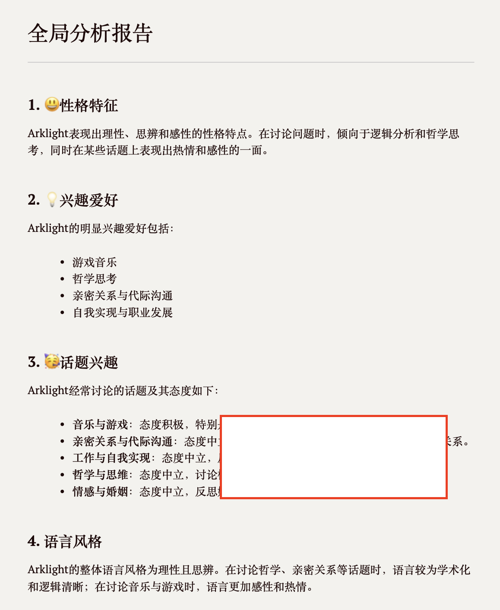
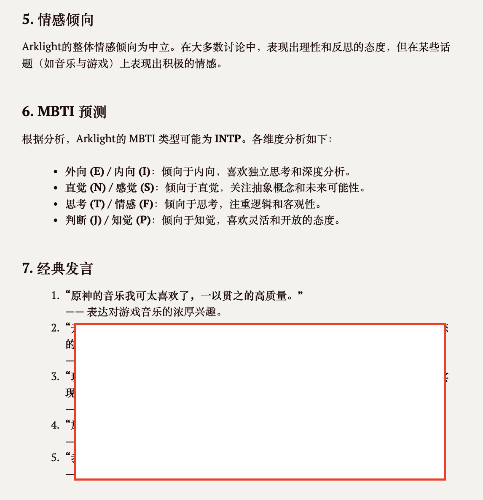

# 微信聊天记录分析工具

## 项目简介

一个基于deepseek的微信聊天记录分析工具，可以对导出的微信聊天记录进行智能分析画像。该工具能够：

- 自动分析聊天记录中的话题和主题
- 生成用户性格特征和行为模式分析
- 支持大规模聊天记录的分块处理




## 安装要求

- Python3
- pandas
- openai


## 使用方法

### 1. 环境配置

1. 克隆项目后，首先安装所需依赖：
```bash
pip install -r requirements.txt
```

2. 配置DeepSeek API密钥：
在`config.json`文件中设置你的API密钥：
```json
{
    "api_key": "your-api-key-here",
    "output_dir": "output",
    "prompts_dir": "prompts",
    "max_workers": 10
}
```

然后，通过工具导出xlsx格式的聊天记录（记得筛出自己的聊天记录部分）

### 2. 运行程序

基本用法：
```bash
python main.py -i <聊天记录文件.xls>
```

常用参数说明：
- `-i, --input`: 输入的XLS文件路径（必需）
- `-m, --max-chars`: 分块大小（默认50000字符，最大建议不要超过6万）
- `-S, --summarize`: 生成最终汇总报告
- `-t, --top-n`: 选取的话题数量（默认为全部）

示例：
```bash
# 基本分析
python main.py -i chat.xls

# 生成汇总报告，并限制话题数量，指定分块大小
python main.py -i chat.xls -S -t 10 -m 30000
```

### 参数的设置说明：
- 在分块大小大于一个适当值（可能是3000）时，分块大小越小，分析效果越好。
  - 因为Deepseek会从每个块中提取有限数量的话题，较小且较多的能够被Deepseek分析地更透彻。
  - 但分块大小越小，分块数量会越多，分析时间就越长
- 选取的话题数量越多，对人物的刻画越详细。
  - 程序会将分块处理的结果汇总，选出Top N的话题，再次调用Deepseek API进行分析。
  - 但数量太多可能会导致分析过拟合
- 参数建议（分块保持在5-15，话题数10-20，单个块的word count几千字）
  - 聊天记录在400条以下： -m 3000 -t 10
  - 聊天记录在400-1000条左右：-m 5000 -t 10
  - 聊天记录1000-5000条： -m 10000 -t 15
  - 聊天记录5000-10000条： -m 15000 -t 20

## 输出
```
output/
├── chunks/                 # 分块处理目录
│   ├── chunk_{n}.txt      # 分割后的文本块
│   └── result_{n}.txt     # 每个块的分析结果
├── merged_chat.txt        # 合并的聊天记录
├── merged_results.txt     # 合并的分析结果
├── final_report.txt       # 汇总报告（可选）
├── summary.json           # 总体分析汇总
└── {用户ID}_profile.json  # 用户画像文件
```

